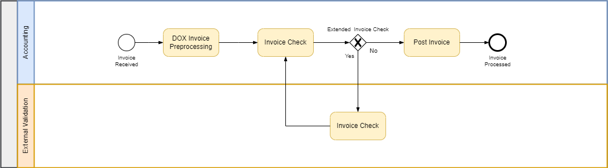

# Facilitate Invoice Validation — leveraging Document Information Extraction
<!--- Register repository https://api.reuse.software/register, then add REUSE badge:

-->
Invoice validation is often a tedious, manual, error-prone and opaque process. It can involve editing PDF files directly; sending emails back and forth again and again between multiple parties (e.g., external domain
experts); until the invoice can be approved for payment. This sample wants to alleviate exactly this manual work. To do that, it supposes a clearly laid out validation process, and more importantly
simplifies the validation itself in that it leverages the Document Information Extraction ([DOX](https://help.sap.com/docs/document-information-extraction/document-information-extraction/what-is-document-information-extraction?locale=en-US))
service on the Business Technology Platform ([BTP](https://help.sap.com/docs/btp/sap-business-technology-platform/sap-business-technology-platform?locale=en-US)),
and the Cloud Programming Model ([CAP](https://cap.cloud.sap/docs/)).

The sample runs entirely on BTP, think of it as a separate extension to _SAP Central Invoice Management (CIM)_ or _OpenText Vendor Invoice Management (VIM)_, rather than it trying to compete with the latter.

This sample supposes the following process flow (simplified for demonstration purposes):

<figure>
  
  <figcaption>Process flow used for demonstration purposes</figcaption>
</figure>

It consists of these steps:
1. Let's assume the invoice arrives via email as a _PDF attachment_, or via _postal letter_, and is then _scanned_.
2. DOX extracts (from the invoice PDF file) any column fields, and their corresponding values for _each_ _Position_ (a prefix that identifies each entry/row in the invoice).
3. The invoice is dispatched to the correct processor, an _Accounting Team Member_ for validation. Should additional expert domain knowledge be required, the Accounting Team Member can forward the invoice to an _External Validator_ for validation.
4. The External Validator checks the invoice in detail, e.g., corrects the values (think unit price, or amount etc.) for certain Positions (_Position Corrections_), makes _Deductions_ associated with a Position, or _Retentions_. Once finished, the External Validator forwards the invoice back to the Accounting Team Member.
5. The Accounting Team Member checks the validated invoice one last time, and finally sends it off to _SAP Central Invoice Management_ (CIM), _OpenText Vendor Invoice Management_ (VIM) or any other comparable solution.

## Requirements

## Download and Installation

## Known Issues
No known issues as of now.

## How to obtain support
[Create an issue](https://github.com/SAP-samples/<repository-name>/issues) in this repository if you find a bug or have questions about the content.
 
## Contributing
If you wish to contribute code, offer fixes or improvements, please send a pull request. Due to legal reasons, contributors will be asked to accept a DCO when they create the first pull request to this project. This happens in an automated fashion during the submission process. SAP uses [the standard DCO text of the Linux Foundation](https://developercertificate.org/).

## License
Copyright (c) 2024 SAP SE or an SAP affiliate company. All rights reserved. This project is licensed under the Apache Software License, version 2.0 except as noted otherwise in the [LICENSE](LICENSE) file.
