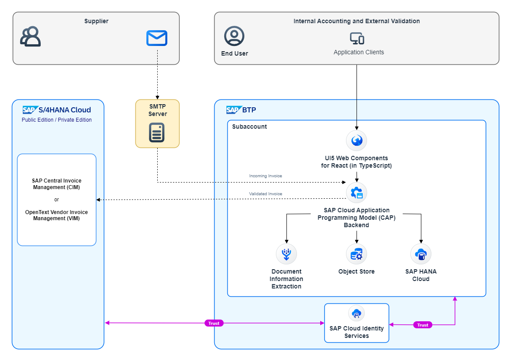

# Facilitate Invoice Validation — leveraging Document Information Extraction

Invoice validation is often an opaque, manual and error-prone process. It involves editing invoice PDF files directly, or sending them back and forth via email between multiple parties—
until it can finally be approved for payment.

This sample tries to alleviate some of those pain points. It presupposes a clearly defined validation workflow. More importantly,
it simplifies and accelerates validation, allowing to quickly copy over entries from the original invoice, correct entries; and then forward the invoice to the next person in line
in the workflow to validate it further. As a side effect each correction and the rationale behind it is documented over time.

For that _Document Information Extraction_ ([DOX](https://help.sap.com/docs/document-information-extraction/document-information-extraction/what-is-document-information-extraction?locale=en-US))
—a service on the _Business Technology Platform_ ([BTP](https://help.sap.com/docs/btp/sap-business-technology-platform/sap-business-technology-platform?locale=en-US))—
and the _Cloud Programming Model_ ([CAP](https://cap.cloud.sap/docs/)) is leveraged. The sample runs _entirely_ on BTP. Think of it as a separate extension to _SAP Central Invoice Management_ (CIM)
or _OpenText Vendor Invoice Management_ (VIM), rather than it trying to compete with the latter.

<!-- shows correctly with GitHub's markdown flavor -->
> [!IMPORTANT]
> The sample was built on AWS infrastructure on BTP. Therefore, we went with the Amazon S3 variant
> of the BTP Object Store service, while the CAP backend talks to the S3 via the AWS Client S3 SDK. Generally, the sample
> can also be run on GCP or Azure, if you slightly adjust the part of the code, that talks to the Object Store, and use
> the according store variant.

    
    <em>Sample architecture with DOX and CAP at its core</em>

## Getting started
Feel free to check out these links to get started working with the sample. 

- Intro
  - [Scenario](./docs/tutorial/1-intro/1-Scenario.md)
  - [Improvements](./docs/tutorial/1-intro/2-Improvements.md)
  - [Interaction](./docs/tutorial/1-intro/3-Interaction.md)
- Setup
  - [Subaccount](./docs/tutorial/2-setup/1-Subaccount.md)
  - [Initial Deployment](./docs/tutorial/2-setup/3-InitialDeployment.md)
  - [Extensions](./docs/tutorial/2-setup/4-Extensions.md)
- Integration
  - [Inbound](./docs/tutorial/3-integrate/1-Inbound.md)
  - [Outbound](./docs/tutorial/3-integrate/2-Outbound.md)
  - [Notifications](./docs/tutorial/3-integrate/3-Notifications.md)

## Known Issues
No known issues as of now.

## How to obtain support
[Create an issue](https://github.com/SAP-samples/btp-cap-dox-invoice-validation/issues) in this repository if you find a bug or have questions about the content.
 
## Contributing
If you wish to contribute code, offer fixes or improvements, please send a pull request. Due to legal reasons, contributors will be asked to accept a DCO when they create the first pull request to this project. This happens in an automated fashion during the submission process. SAP uses [the standard DCO text of the Linux Foundation](https://developercertificate.org/).

## License
Copyright (c) 2024 SAP SE or an SAP affiliate company. All rights reserved. This project is licensed under the Apache Software License, version 2.0 except as noted otherwise in the [LICENSE](LICENSE) file.
