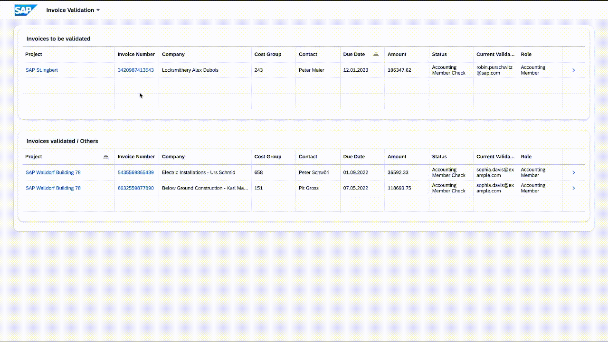

# Facilitate Invoice Validation — leveraging Document Information Extraction
<!--- Register repository https://api.reuse.software/register, then add REUSE badge:

-->
Invoice validation is often an opaque, manual and error-prone process. It might involve editing invoice PDF files directly; and sending them back and forth via email between multiple parties;
until it can finally be approved for payment.

This sample tries to alleviate some of those pain points. It presupposes a clearly defined validation process. More importantly,
it simplifies validation, allowing to quickly copy over entries from the original invoice, correct them; and then forward the invoice for someone else
to validate it further. At the same time, each correction and the reason for it is documented over time.

<!-- workaround to make img look nice on GitHub with centered subtitle (copied from https://github.com/SAP-samples/btp-cap-genai-rag/blob/main/README.md) -->

    
    <em>Invoice correction simplified with the help of DOX</em>

For that _Document Information Extraction_ ([DOX](https://help.sap.com/docs/document-information-extraction/document-information-extraction/what-is-document-information-extraction?locale=en-US))
—service on the _Business Technology Platform_ ([BTP](https://help.sap.com/docs/btp/sap-business-technology-platform/sap-business-technology-platform?locale=en-US))—
and the _Cloud Programming Model_ ([CAP](https://cap.cloud.sap/docs/)) is leveraged. The sample runs _entirely_ on BTP. Think of it as a separate extension to _SAP Central Invoice Management_ (CIM)
or _OpenText Vendor Invoice Management_, rather than it trying to compete with the latter.

    
    <em>Components of architecture for sample: Facilitate Invoice Validation — leveraging Document Information Extraction</em>

The sample presupposes a process flow (simplified for demonstration purposes) that covers the following steps:
1. The invoice arrives via email as _PDF attachment_ or via _postal letter_, which will be scanned into PDF format.
2. The invoice PDF file will be preprocessed by the DOX service.
3. The invoice will be dispatched to the correct processor and afterwards validated by an _Accounting Team Member_. In case of additional expert domain knowledge is necessary, then the invoice could be forwarded to an _Internal_ or _External Validator_.
4. The Internal or External Validator is doing an detailed invoice check, e.g. doing _Position Corrections_, _Deductions_ and _Retentions_. After he finished his work he sends back the invoice to the Accounting team member.
5. The Accounting Team Member is doing a last double check and forwards the validated invoice to CIM, OpenText Vendor Invoice Management or any other comparable solution.

    
    <em>Process flow used for demonstration purposes</em>

## Prerequisites

This sample requires a subaccount that uses _Cloud Foundry_ as application runtime, and expects the following service _entitlements_ to be assigned:

Service Name | Service Plan | Available Hyperscalers
--- | --- |  ---
Destination Service | lite | All
Authorization and Trust Management Service (XSUAA) | application | All
SAP HANA Schemas & HDI Containers | hdi-shared | All
Object Store | s3-standard | AWS only
Document Information Extraction (DOX) | premium_edition | AWS only

## Getting started
To get the sample up and running for the first time, head to [Initial Deployment](./docs/tutorial/2-setup/InitialDeployment.md). If you want to run the sample locally or extend it,
check out [Setup for Local Development](./docs/tutorial/2-setup/DevSetup.md).

To get a more thorough understanding of how the sample's components work/fit together; and what benefits are possible with the help of DOX,
feel free to follow these links:
- [Detailed description of the scenario](./docs/tutorial/1-intro/1-Scenario.md)
- [Application Interaction](./docs/tutorial/1-intro/1-Scenario.md)
- [UI Improvements](./docs/tutorial/1-intro/1-Scenario.md)

## Known Issues
No known issues as of now.

## How to obtain support
[Create an issue](https://github.com/SAP-samples/<repository-name>/issues) in this repository if you find a bug or have questions about the content.
 
## Contributing
If you wish to contribute code, offer fixes or improvements, please send a pull request. Due to legal reasons, contributors will be asked to accept a DCO when they create the first pull request to this project. This happens in an automated fashion during the submission process. SAP uses [the standard DCO text of the Linux Foundation](https://developercertificate.org/).

## License
Copyright (c) 2024 SAP SE or an SAP affiliate company. All rights reserved. This project is licensed under the Apache Software License, version 2.0 except as noted otherwise in the [LICENSE](LICENSE) file.
