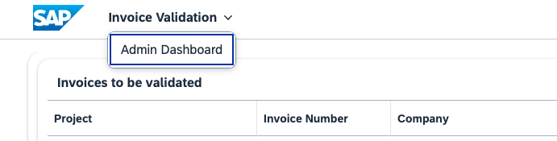

## Initial Deployment
To get the app up and running for the first time, you do a first initial deployment. This will create any required service instances which are described in the
`mta.yaml` deployment descriptor file. The following command-line tools are used for that, which you need to install.

1. Cloud MTA Build Tool ([MBT](https://sap.github.io/cloud-mta-build-tool/)) to build the application (app) and get it ready for deployment
2. Cloud Foundry CLI ([CF CLI](https://github.com/cloudfoundry/cli/wiki/V8-CLI-Installation-Guide))

Double check, whether you have [Node](https://nodejs.org/en) installed. The sample is built with Node version 20, so this is the version we recommend here.
To manage multiple Node versions you can use [NVM](https://github.com/nvm-sh/nvm). To check your current Node version, run:
```
node --version
```

Now onwards to doing the actual deployment.

1. First, clone the git repository:
```
git clone https://github.com/SAP-samples/btp-cap-dox-invoice-validation.git

cd btp-cap-dox-invoice-validation 
```

2. Install the required packages:
```
npm install -g @sap/cds-dk typescript ts-node
npm run setup
```

3. Then, login to your subaccount and space with:
```
cf login
```

4. Next, issue the following command (while being at root level of your project directory) to _build_ and _deploy_ the whole app at once to your subaccount:
```
npm run deploy
```

5. Within the BTP Cockpit inside your subaccount, create a [role collection](https://cap.cloud.sap/docs/node.js/authentication#auth-in-cockpit) _DOX\_Mission\_Administrator_ and add the _Administrator_ role to it; then assign yourself to the collection. (The role was precreated during the deployment and you will find it in the roles list under _Security_ in your subaccount, if you filter by _mission_.)

Last but not least a destination has to be created (manually in this case), which our app uses to connect to the DOX service.
For that create a [service key](https://help.sap.com/docs/service-manager/sap-service-manager/creating-service-keys-in-cloud-foundry?version=Cloud&locale=en-US) for the destination service itself and name it _dox-iv-api-dest-key_. In it you find the credentials to enter for the placeholders (shown below) of the actual destination.

To then create the destination, log in to your SAP BTP cockpit and navigate to your subaccount. In the navigation area therein, go to Connectivity -> Destinations and select _Create Destination_.
Note that the name of the destination needs to be precisely _DOX_PREMIUM_INVOICE_VALIDATION_. This is what the app is going to look for later on.
```
Name: DOX_PREMIUM_INVOICE_VALIDATION
Description: Connection to Document Information Extraction (DOX) service
URL: <URL-PROPERTY-IN-DOX-SERVICE-KEY>/document-information-extraction/v1 # make sure to add /v1!
Type: HTTP
ProxyType: Internet
Authentication: OAuth2ClientCredentials
tokenServiceURL: <AUTH-URL-IN-DOX-SERVICE-KEY>/oauth/token
clientId: <CLIENT-ID-IN-DOX-SERVICE-KEY>
clientSecret: <CLIENT-SECRET-IN-DOX-SERVICE-KEY>
# Additional Properties:
URL.headers.Content-Type: application/json
HTML5.DynamicDestination: true
```

If the deployment ran through successfully, you can open up the frontend part of the app in your browser under _applications_ in your BTP space, by clicking first
on _dox-invoice-validation_ and then on the shown link. As an admin (see step 5 above) head over to the Admin Dashboard to add new users on the application level.



Here, you can assign them to any project and set their roles. Note any users that are supposed to have access to the application need to be added to the BTP Space as well within the BTP Cockpit.
